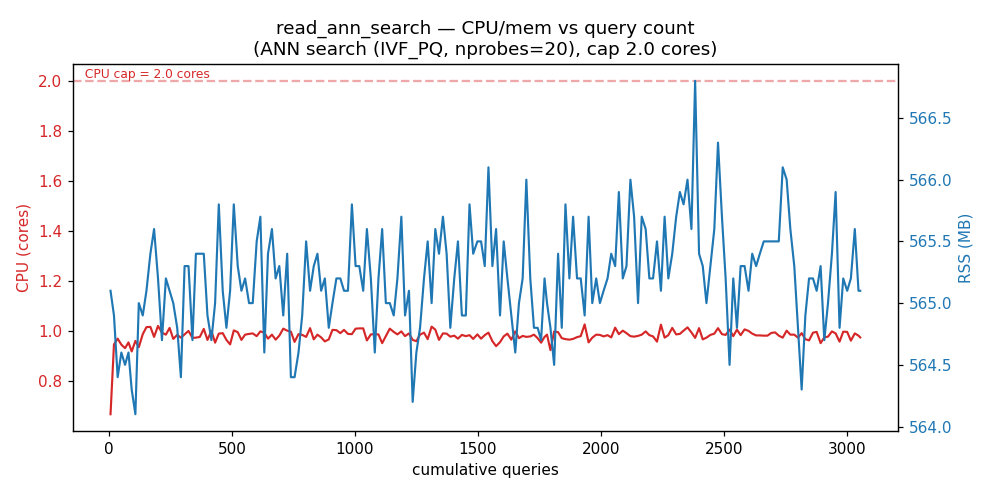
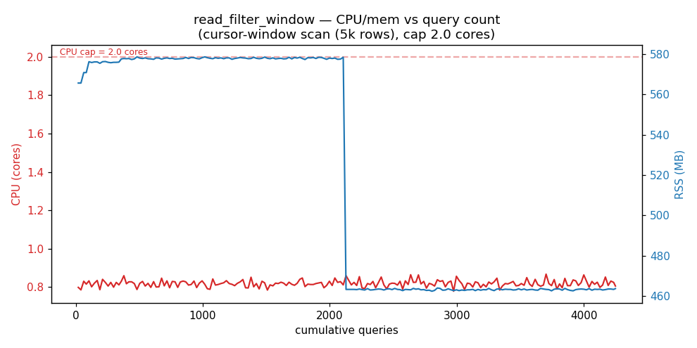
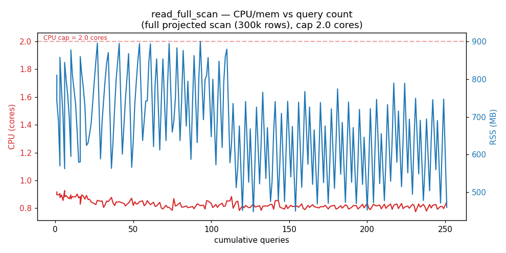
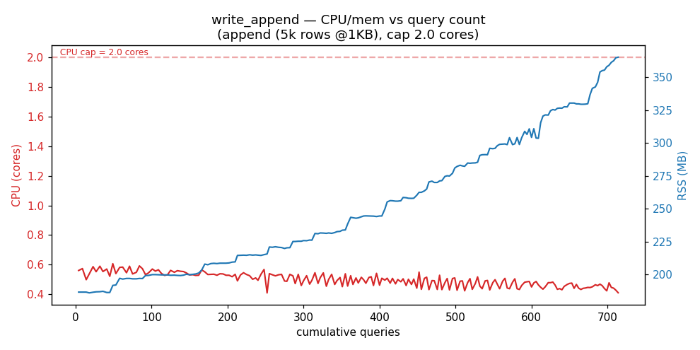
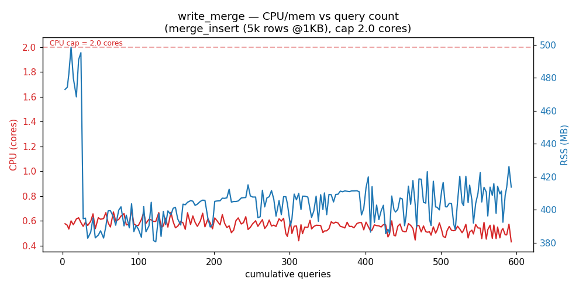
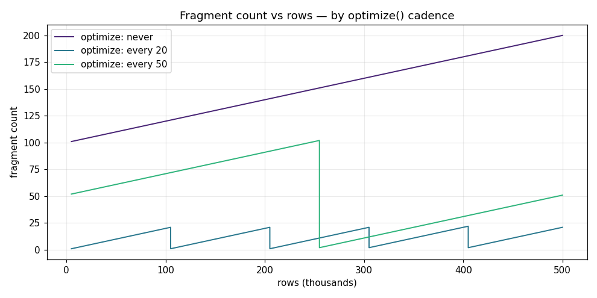
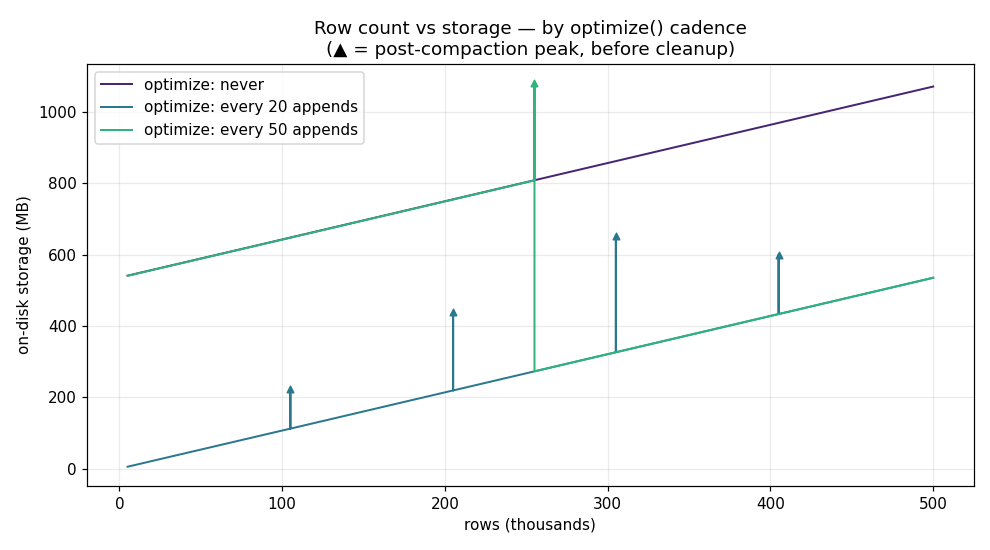
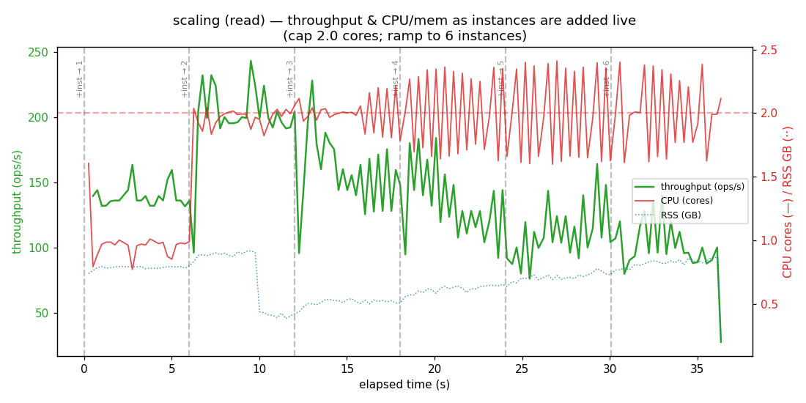
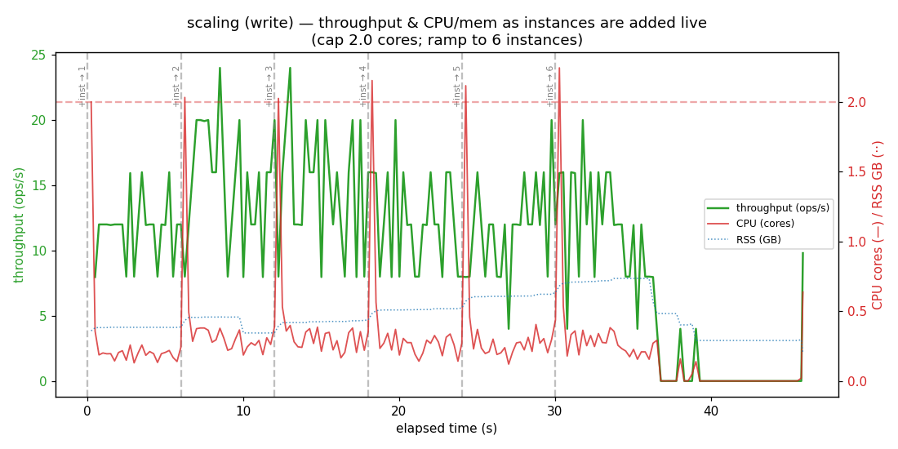

# LanceDB Scaling Characterization — Report

_Resource cap(s): **2cpu-4g** (disk uncapped). LanceDB pinned to prod version (lancedb 0.33.0). Backend: MinIO (S3) + DynamoDB-local._

### Q1 — How much can we write?

**Blob (MOVEIT schema, `data` payload):**

| op | payload_bytes | rows_per_batch | rows_per_s | mb_per_s | peak_rss_mb | cpu_s |
| --- | --- | --- | --- | --- | --- | --- |
| append | 1024 | 131072 | 458162.3 | 469.2 | 789.0 | 0.51 |
| merge_insert | 1024 | 131072 | 254228.3 | 260.3 | 985.6 | 0.5 |
| append | 10240 | 13107 | 67793.5 | 694.2 | 1132.3 | 0.34 |
| merge_insert | 10240 | 13107 | 39497.9 | 404.5 | 1256.3 | 0.28 |
| append | 102400 | 1310 | 23426.2 | 2398.8 | 1267.6 | 0.09 |
| merge_insert | 102400 | 1310 | 7259.8 | 743.4 | 1407.9 | 0.18 |

**Vector (768-dim):**

| op | rows | rows_per_s | mb_per_s | peak_rss_mb | wall_s |
| --- | --- | --- | --- | --- | --- |
| append | 150000 | 106610.6 | 327.5 | 1503.9 | 1.407 |
| create_index_ivf_pq | 200000 |  |  | 1913.8 | 145.5316 |

### Q2 — How much can we read?

**Blob scans:**

| op | rows_per_s | mb_per_s | p50_ms | p95_ms | p99_ms | pages_per_s |
| --- | --- | --- | --- | --- | --- | --- |
| full_scan_projected | 3827501.4 | 3919.4 |  |  |  |  |
| filtered_scan_5k_window |  |  | 5.0 | 5.55 | 5.79 |  |
| keyset_paging |  |  |  |  |  | 354.73 |

**Vector ANN search:**

| index | nprobes | qps | p50_ms | p95_ms | p99_ms |
| --- | --- | --- | --- | --- | --- |
| none_flat |  | 4.1 | 241.81 | 254.28 | 266.47 |
| IVF256_PQ96 | 10 | 177.1 | 4.98 | 8.56 | 10.69 |
| IVF256_PQ96 | 50 | 110.2 | 8.77 | 11.13 | 12.09 |

> ⚠️ **FINDING (known upstream bug — FIXED in newer Lance):** filtering on a low-cardinality/constant string column (`object_type = 'messages'`) **panics** in lance 0.33 (`lance-encoding buffer.rs` slice overflow). Lance adaptively *dictionary-encodes* low-cardinality string columns and the v2/2.1 dictionary **decode** path had buffer-slicing bugs — a documented cluster: [lance#2828](https://github.com/lancedb/lance/issues/2828) (`Dictionary<_, LargeString>`, same panic), [lance#2939](https://github.com/lance-format/lance/issues/2939), [lance#4071](https://github.com/lancedb/lance/issues/4071). **Verified empirically:** the identical probe PANICS on lancedb/lance 0.33.0 but returns all rows on **lancedb 0.34.0 / lance 8.0.0** (latest) — fixed. **MOVEIT implication:** MOVEIT's Rust crate pins `lance = "8.0.0"` (the fixed version), so its read path is most likely NOT affected; this bench hit it only because it pinned Python `lancedb==0.33.0` to mirror the documented stack. Any Python `lancedb ≤0.33` reader WOULD be affected. Numeric `cursor` keyset and unique-`id` filters are unaffected in all versions. Error on 0.33: `External error: RuntimeError: Task was aborted`

### Q3/Q4/Q5 — Multiple instances on one S3 table: correctness & latency

Yes — multiple processes can open the same S3 dataset and write concurrently. `lost_keys > 0` would mean commits clobbered each other (data loss). Two commit paths:
- **safe_ddb** — `s3+ddb://` external DynamoDB commit store (serialises commits everywhere).
- **unsafe_s3** — plain `s3://` relying on the object store's own atomic conditional-PUT.

Both use LanceDB's default MVCC/optimistic-concurrency commit; conflicts are retried internally (visible as tail-latency growth, not as errors). Note MOVEIT prod additionally runs a lower-level `UnsafeCommitHandler` (a Rust-side bypass) to work around *older* MinIO that lacked conditional-PUT — that is the only configuration that risks silent loss.

| mode | shape | writers | expected_distinct_keys | actual_distinct_keys | lost_keys | data_loss | total_conflicts | wall_s | commit_p50_ms | commit_p95_ms | commit_p99_ms |
| --- | --- | --- | --- | --- | --- | --- | --- | --- | --- | --- | --- |
| safe_ddb | disjoint | 2 | 8000 | 8000 | 0 | False | 0 | 0.573 | 34.99 | 145.67 | 145.67 |
| safe_ddb | disjoint | 4 | 16000 | 16000 | 0 | False | 0 | 0.796 | 38.92 | 185.77 | 185.77 |
| safe_ddb | overlap | 2 | 4000 | 4000 | 0 | False | 0 | 0.56 | 41.53 | 158.67 | 158.67 |
| safe_ddb | overlap | 4 | 4000 | 4000 | 0 | False | 0 | 0.967 | 150.75 | 302.91 | 302.91 |
| unsafe_s3 | disjoint | 2 | 8000 | 8000 | 0 | False | 0 | 0.624 | 19.0 | 229.2 | 229.2 |
| unsafe_s3 | disjoint | 4 | 16000 | 16000 | 0 | False | 0 | 0.623 | 23.36 | 93.29 | 93.29 |
| unsafe_s3 | overlap | 2 | 4000 | 4000 | 0 | False | 0 | 0.638 | 21.18 | 259.53 | 259.53 |
| unsafe_s3 | overlap | 4 | 4000 | 4000 | 0 | False | 0 | 1.253 | 28.08 | 567.01 | 567.01 |

### Q6 — 2GB column cap (and lifting it)

- int32 offset ceiling: **2,147,483,647 bytes** (~2 GiB)
- Construct >2GB `large_binary` array (64-bit offsets): **succeeded — cap lifted**
- Same array cast to int32 `binary`: **FAILED — 2GB cap confirmed** — Failed casting from large_binary to binary: input array too large
- Write a single >2GB batch to Lance under the cap: **succeeded** (2200 rows)
- Grow a column PAST 2GB via many <2GB `binary` batches: logical **2,400,000,000 B** across 24 batches, exceeded_2gb=True, on-disk 4,800,190,530 B (48 fragments)

**Verdict:** the ~2GB cap is real and is *per write array/batch per column* (int32 offsets), not a per-dataset limit. Lift a single large value/batch with Arrow `large_string`/`large_binary` (64-bit offsets); for MOVEIT's `data` column the practical path is keeping each write batch under 2GB — the column total grows unbounded across fragments regardless.

### Q7 — optimize() / compaction overhead

| input_fragments | rows | fragments_before | fragments_after | compact_wall_s | compact_cpu_s | compact_peak_rss_mb | rewrite_amplification | bytes_reclaimed_by_cleanup | cpu_s_per_1k_frags |
| --- | --- | --- | --- | --- | --- | --- | --- | --- | --- |
| 100 | 100000 | 101 | 102 | 0.519 | 0.46 | 367.2 | 1.5 | 214234092 | 4.6 |
| 300 | 300000 | 303 | 306 | 1.403 | 1.31 | 455.6 | 1.5 | 646491635 | 4.367 |
| 500 | 500000 | 505 | 510 | 2.115 | 2.23 | 439.4 | 1.49 | 1082010783 | 4.46 |

CPU/RSS scale with rows+fragments rewritten; S3 cost is the rewrite amplification (old+new files coexist until `cleanup_old_versions`). Public data point for scale: a 60M-row table with a 768-dim vector exceeded **250GB RAM** during optimize — plan compaction cadence and memory accordingly ([lancedb#3201](https://github.com/lancedb/lancedb/issues/3201)).

### Graphs

_Rendered from real runs; see `results/graphs/`._

**What the graphs show (measured, not modelled):**
- **Vertical-scaling ceiling** (`scaling_read`): under the 2-core cap, read throughput climbs 1→2 instances (~1→2 cores) then **plateaus and degrades** as instances 3–6 are added live — CPU is pinned at the cap and extra instances only add context-switch contention. Writes (`scaling_write`) never saturate CPU (~0.3 cores): they're commit/IO-bound, so they scale on a different axis (object-store round-trips), not cores.
- **optimize() cadence vs storage** (`optimize_storage`): never-compacting grew to **~1071 MB / 200 fragments** for 500k rows, ~**2× the ~535 MB / 21 fragments** of compact-every-20 — many small append-fragments store the same rows far less efficiently. ▲ marks the transient ~2× spike during compaction (old+new coexist) reclaimed by `cleanup_old_versions`.
- **CPU/mem vs query count** (`ts_*`): scans hold <1 core with an RSS sawtooth per materialisation; merge_insert is the CPU-heaviest write pattern.

**Time-series — CPU/mem vs query count (per pattern)**

**Row count vs storage — by optimize() cadence**

**Vertical scaling — instances added while queries run**

### Scaling levers → how each moves the ceiling

| Lever | Effect on ceiling |
| --- | --- |
| Batch size | Larger batches amortise commit/manifest overhead → higher rows/s & MB/s, until memory-bound under the cap. |
| append vs merge_insert | `append` is cheap & commutative (auto-retries, rarely conflicts); `merge_insert` reads+rewrites matched fragments and conflicts under concurrency. |
| Commit store (s3 vs s3+ddb) | Plain `s3://` needs an object store with atomic put for safe concurrency; `s3+ddb://` serialises commits safely everywhere (incl. MinIO) at the cost of commit latency. |
| Vector index (IVF_PQ) | Turns brute-force O(N) scan into sub-linear ANN → large read QPS gain; `nprobes` trades recall for latency; index build is memory-heavy. |
| Fragment count / optimize cadence | Many small fragments slow reads & metadata; compaction restores it but is the most expensive write op — keep ≤~100 fragments/1B rows. |
| use_large_var_types (large_string/binary) | Lifts the per-batch 2GB cap on var-width columns (64-bit offsets) at a small size cost. |
| Horizontal instances / sharding | Object storage QPS is concurrency-bound; multiple reader instances scale reads linearly; writers must coordinate (single-writer-per-table or a commit store). |

### Caveats

- **MinIO ≠ AWS S3 for concurrency.** On this MinIO release (2025-09) both commit paths were
  loss-free, i.e. its atomic conditional-PUT works — the `safe_ddb` (DynamoDB) numbers are the
  ones that transfer to any object store. AWS S3 has native atomic conditional-PUT too; the only
  path that risks silent loss is MOVEIT's Rust-side `UnsafeCommitHandler` on *older* MinIO that
  lacked it (not reproduced here — pylance doesn't expose that bypass).
- **Blob payloads are highly compressible** (repeated filler), so blob MB/s is a logical-throughput
  upper bound; on-disk bytes are far smaller. rows/s and latency are unaffected.
- **On-disk bytes include superseded versions** until `cleanup_old_versions` runs (visible as
  rewrite_amplification in Q7 and the >logical on-disk size in Q6).
- All numbers are under the capped container (see cap label); they are a *floor* on real hardware,
  not a hardware benchmark. Vector index build (IVF_PQ) took ~147s on 200k×768 under 2 vCPU —
  index construction is the CPU-heaviest single op measured.
